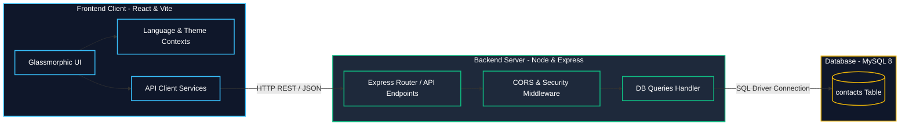

# 💼 Immersive Full-Stack Portfolio — Anas Haddou

<p align="center">
  <a href="#-english-version">English Version</a> • 
  <a href="#-version-française">Version Française</a>
</p>

---

## 🇺🇸 English Version

[](https://react.dev/)
[](https://vitejs.dev/)
[](https://tailwindcss.com/)
[](https://www.framer.com/motion/)
[](https://nodejs.org/)
[](https://expressjs.com/)
[](https://www.mysql.com/)

Welcome to the source code of my **Immersive Full-Stack Portfolio**. Designed to be my central online presence, this application provides an interactive, beautiful representation of my skills, professional experiences, and recent engineering projects. It is built using a modern decoupled architecture: a highly responsive React client frontend communicating with a secure Express API backend backed by a MySQL database.

---

### 🚀 Key Features

*   🌍 **Bilingual Support (EN / FR):** Instant toggle between English and French translations throughout the app.
*   🌓 **Dynamic Theme Toggle:** Elegant transition between premium dark mode (default) and light mode.
*   📱 **Responsive Glassmorphic UI:** Smooth, modern styling using Tailwind CSS and Framer Motion micro-animations.
*   📂 **Interactive Projects Gallery:** Search, category filtering, and immersive modals with detailed feature descriptions, technical stack tags, and links.
*   ✉️ **Functional Contact Form:** Directly connected to the MySQL database via the Express API backend with client-side validation.

---

### 🏗️ Technical Architecture

This application follows a classic, decoupled three-tier architecture:



---

### 📂 Showcase of Linked Engineering Projects

Here are the key engineering projects referenced and linked directly in my portfolio:

| Project Name | Technology Stack | Key Features |
| :--- | :--- | :--- |
| **⚡ [Smart Grid Optimizer](https://github.com/Anas15161/SmartGrid)** | React 18, PyTorch, SB3 (PPO), Kafka, InfluxDB, MQTT, Docker | Distributed AI-driven electrical network optimizer using Reinforcement Learning to mitigate grid load peaks. |
| **📡 [Telecom Churn Analytics](https://github.com/Anas15161/Telecom-Churn-Analytics)** | Flask, Python, Scikit-Learn (Random Forest, SMOTEENN), HTML5/CSS3/JS | Customer churn prediction platform using machine learning with live batch prediction features. |
| **🚀 [DevOps CI/CD Dashboard](https://github.com/Anas15161/devops-ci-cd-dashboard)** | Node.js, Express, Jest, Docker, GitHub Actions, Makefile | Automated delivery pipeline reducing Docker image footprint by 88% and providing real-time deployment metrics. |
| **🛍️ [MiniShop E-Commerce](https://github.com/Anas15161/LaravelProject)** | Laravel 12, Tailwind CSS, AlpineJS, SQLite, DomPDF, Breeze | Complete e-commerce catalog with dynamic shopping cart, checkout flow, automated PDF invoicing, and admin control suite. |
| **📱 [StockMaster Mobile ERP](https://github.com/Anas15161/stockmaster)** | Flutter, Dart, SQLite, BLoC Pattern, MVVM | Offline-first mobile inventory tracking system with camera barcode/QR scanner. |
| **📦 [SmartStock ERP](https://github.com/Anas15161/SmartStockERP)** | Jakarta EE 10, Hibernate, Oracle XE, Jersey, iText 7, JSP | Enterprise-grade inventory and supplier management ERP running on an N-tier architecture. |
| **⚽ [PlayerPredict](https://github.com/Anas15161/PlayerPredict)** | Python, Scikit-Learn, XGBoost, HTML5/JS, Pandas, Joblib | Sports analytics and machine learning application predicting MU lineups based on player metrics. |
| **📝 [GestionNotes Django](https://github.com/Anas15161/GestionNotes)** | Django, Python, SQLite, Bootstrap, HTML/CSS | School grading and course registration management portal with custom admin controls. |
| **☕ [GestionNotes Java Swing](https://github.com/Anas15161/Gestion-Notes-Java-Swing)** | Java SE, Swing, MySQL, JDBC | Desktop client software for academic grading record management with JDBC persistence. |
| **🏥 [Hospital UML & Django](https://github.com/Anas15161/Syst-me-de-Gestion-Hospitali-re-Mod-lisation-UML)** | Django, UML, Python, MySQL, Bootstrap | Hospital resource scheduler engineered from detailed UML design diagrams. |

---

## 🇫🇷 Version Française

Bienvenue dans le code source de mon **Portfolio Professionnel Immersif**. Conçu pour être ma vitrine en ligne, cette application propose une représentation interactive et soignée de mes compétences, parcours académique, expériences professionnelles et projets d'ingénierie. 

Le système repose sur une architecture découplée : un client léger React communiquant via des requêtes REST JSON avec une API Node.js/Express, elle-même connectée à une base de données MySQL.

### 🚀 Fonctionnalités Clés

*   🌍 **Support Bilingue (FR / EN) :** Passage instantané du français à l'anglais sur l'intégralité du contenu.
*   🌓 **Mode Sombre/Clair Dynamique :** Interface élégante par défaut en mode sombre avec transition fluide vers le mode clair.
*   📱 **Design Glassmorphique & Responsive :** Animations fluides avec Framer Motion et mise en page responsive avec Tailwind CSS.
*   📂 **Galerie de Projets Interactive :** Filtres par catégorie et modaux détaillant l'architecture, la stack technique et les liens de chaque projet.
*   ✉️ **Formulaire de Contact Actif :** Liaison directe avec la base de données MySQL pour sauvegarder les messages reçus.

---

## 🛠️ Installation & Setup (French & English)

### 📂 Directory Structure / Structure du Projet

```text
portfolio/
├── database/            # Database initialization SQL scripts
├── client/              # React frontend (Vite, Tailwind CSS, Framer Motion)
├── server/              # Node.js & Express API backend
├── .gitignore           # Ignored git files configuration
└── README.md            # Repository documentation (this file)
```

---

### 1. Database Setup / Configuration de la Base de Données

Make sure you have **MySQL 8** running on your local machine. Run the initialization script to create the database and the contacts table:

*Assurez-vous que **MySQL 8** est démarré. Exécutez le script pour créer la base `portfolio_db` et la table `contacts` :*

```bash
# Log in and execute the SQL file
mysql -u root -p < database/init.sql
```

---

### 2. Backend Server Setup / Configuration du Serveur Backend

Navigate to the `server/` folder to install dependencies and run the API:

*Allez dans le dossier `server/` pour installer les dépendances et démarrer l'API :*

```bash
cd server

# Install Node modules
npm install

# Setup environment variables (configure DB credentials)
# Configurez vos accès de base de données dans le fichier .env
cp .env.example .env

# Run the backend in development mode (starts on port 5000)
# Lancez le serveur en mode développement (sur le port 5000)
npm run dev
```

---

### 3. Frontend Client Setup / Configuration de l'Application Client

In a second terminal, navigate to the `client/` folder to install dependencies and launch the dev server:

*Dans un second terminal, allez dans le dossier `client/` pour démarrer l'application React :*

```bash
cd client

# Install packages
npm install

# Run Vite dev server (accessible at http://localhost:5173)
# Démarrez le serveur de développement (accessible sur http://localhost:5173)
npm run dev
```

*Note: To allow downloading the CV, place your PDF CV file at `client/public/cv-anas-haddou.pdf`.*

---

## 👥 Author / Auteur

*   **Anas Haddou** - *Full Stack Software Engineering Student (EMG Rabat)*
    *   📧 Email: [haddouanas18@gmail.com](mailto:haddouanas18@gmail.com)
    *   🔗 LinkedIn: [Anas Haddou](https://linkedin.com/in/anashaddou-91600a308)
    *   🐙 GitHub: [@Anas15161](https://github.com/Anas15161)
